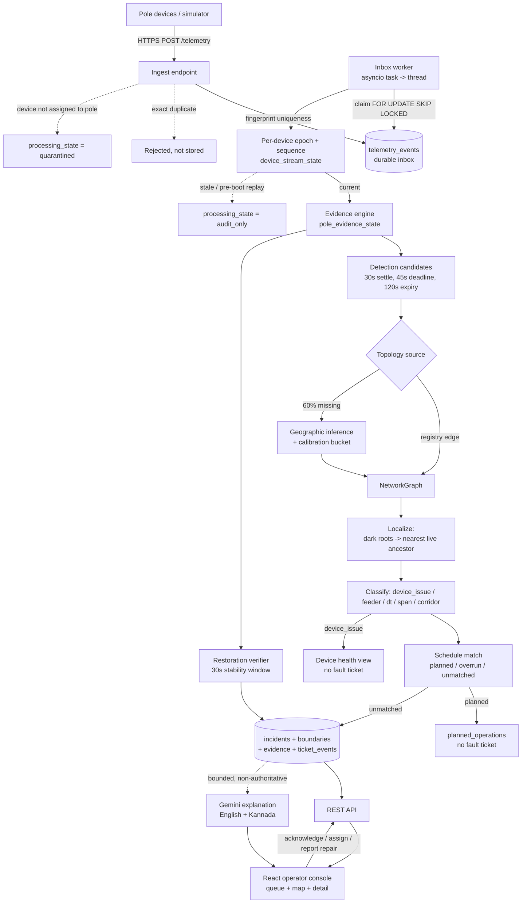

# Architecture

One Docker image. FastAPI serves both the JSON API and the built React SPA;
PostgreSQL holds everything. The telemetry worker and the schedule poller run as
asyncio tasks inside the same process, which is why the deployment runs exactly
one Uvicorn process — each background loop must have a single owner.

## Data flow

## Ingestion

`POST /api/v1/telemetry` does validation, exact-duplicate detection and a
durable write. Nothing else. Detection happens later, off the request path, so a
burst cannot stall behind analysis.

**Duplicates.** Every payload is reduced to a canonical fingerprint over device,
pole, sequence, timestamp and event type. The fingerprint carries a unique index,
and insertion uses `ON CONFLICT DO NOTHING ... RETURNING id`. A `NULL` return
means the event already existed, and the API answers `{"outcome": "duplicate"}`.
Duplicates are never stored, so there is no per-device duplicate count to
display — the device-health view says so rather than inventing one.

**Out-of-order and clock skew.** Device clocks are not trusted for ordering.
`device_stream_state` tracks a per-device epoch and last sequence. A sequence
that goes backwards without a `boot` event is a replay; a `boot` opens a new
epoch. Stale events are still persisted and still auditable, but are marked
`audit_only` and cannot move evidence. Device time and receive time are both
stored, and the operator UI shows both.

**Assignment mismatch.** If the reporting device is not currently assigned to the
pole it claims, the event is stored `quarantined` with a reason and never
influences evidence. Silently trusting it would let a mis-provisioned device
darken a pole it has no relationship with.

**Bursts.** The inbox is the buffer. The worker claims batches of 100 with
`SELECT ... FOR UPDATE SKIP LOCKED`, and continues immediately while batches come
back full, falling back to a 3-second poll only when the inbox empties. Measured:
5,000 events including 500 duplicates produced 4,502 stored and 498 rejected,
with the backlog draining to zero.

## Storage and the topology model

Twenty tables. The ones that carry the design:

| Table | Role |
|---|---|
| `substations`, `feeders`, `transformers`, `poles` | Network assets and geography |
| `topology_edges` | Parent→child edges, each tagged `source` = `registry` / `inferred` / `hidden_truth`, plus `calibration_bucket` |
| `devices`, `device_assignments` | Devices, and which pole each was on **during a time window** |
| `telemetry_events` | Durable inbox. Unique `fingerprint`, `processing_state`, `epoch_decision`, device time and receive time |
| `device_stream_state` | Per-device epoch and sequence, for ordering |
| `pole_evidence_state` | Current electrical belief per pole, with the event that proved it and a freshness deadline |
| `detection_candidates` | Pending suspicions inside the settle window, before any ticket exists |
| `incidents`, `incident_boundaries`, `incident_evidence`, `ticket_events` | One ticket per fault, its hypothesis history, its proof, and its immutable audit trail |
| `scheduled_outages`, `planned_operations` | Planned work, and how observed reality compared to it |
| `ai_explanations` | Bounded model output, never authoritative |
| `simulator_runs`, `simulated_faults` | Scenario truth, confined to the demo path |

**Why edges and not an adjacency column.** Topology is stored as explicit
directed edges with provenance, rather than a `parent_id` on each pole. Three
reasons. Inferred and registry edges must coexist and be told apart at query
time, because confidence depends on which one you used. Hypotheses change as
evidence arrives, and edges let a new belief be added without destroying the old
one. And the hidden ground truth needed for evaluation lives in the same table
under a different `source`, so the simulator never needs a parallel schema.

**Device assignments are time-ranged**, not a foreign key on the pole. A device
that moves must not retroactively rewrite what happened at its old pole.

**Boundaries are append-only.** `incident_boundaries` accumulates; refinement
from corridor to exact span adds a row rather than overwriting one. The operator
can see that the system changed its mind, and why.

## The localization algorithm

The core question is not "which poles are dark" but "where is the boundary
between live and dark".

### 1. Evidence, not silence

Each pole holds one of five states in `pole_evidence_state`:

`confirmed_live` · `confirmed_dark` · `unknown_silent` · `uninstrumented` ·
`device_suspect`

Only a `power_lost` event with `energized = false` produces `confirmed_dark`.
**Silence never becomes darkness.** A heartbeat has a 15-minute freshness window;
when it lapses the pole becomes `unknown_silent`, which is an absence of
information, not evidence of an outage. This single rule is what keeps dead
batteries out of the ticket queue.

### 2. Settle before deciding

A dark event opens or joins a `detection_candidate` keyed by transformer scope,
with a 30-second settle window, a 45-second hard deadline and a 120-second
expiry. Faults arrive as a scatter of messages over seconds; deciding on the
first one produces one ticket per pole. A candidate that never corroborates
expires without ever becoming a ticket.

### 3. Find the boundary

`detection/localization.py`, over a `NetworkGraph` (NetworkX DiGraph) rooted at
the transformer:

1. Take the set of `confirmed_dark` poles. Reduce to **dark roots** — the dark
   poles with no dark ancestor. Everything below a dark root is dark because of
   the same fault, so only the roots are separate faults.
2. From each dark root, walk **upstream** until the first `confirmed_live`
   ancestor or the transformer. That path is the boundary.
3. If the path is exactly two nodes, the parent is confirmed live, and the
   topology is trustworthy, the fault is an **exact span** between them.
   Otherwise it is a **corridor** — the whole path, honestly reported as a search
   area rather than a guessed point.
4. Affected count is `descendants(downstream) + 1`, flagged `estimated` whenever
   the topology under it was inferred.
5. Navigation point is the geometric midpoint of the boundary path, so a crew is
   sent to the middle of the suspect line, not to an arbitrary endpoint.

Complexity is `O(V + E)` per candidate: the dark-root reduction is a reachability
check among dark nodes, and each upstream walk is bounded by tree depth. A DT
subtree is 9–240 poles, so this is microseconds. There is no global search.

### 4. Multiple simultaneous faults

Falls out of the dark-root reduction. Three faults on three branches of one
transformer produce three dark roots, three upstream walks, three boundaries and
three tickets. Nothing merges them, because neither is an ancestor of the other.
Verified end to end: `three_branch_faults` yields exactly three incidents.

Escalation is the opposite move, and it is quorum-based rather than additive.
`detection/classification.py` promotes to **DT scope** when at least
`max(2, 60% of observable branches)` are dark with no live branch remaining, and
to **feeder scope** when at least `max(2, 60% of the feeder's DTs)` qualify inside
a 45-second window. Two unrelated DT faults an hour apart never become a feeder
outage.

### 5. The 60% of transformers with no recorded pole ordering

This is the main problem, not an edge case, and the answer is: **infer the tree,
then refuse to trust it beyond what it has earned.**

`topology/inference.py` builds a candidate graph from geography. For each pole,
the 6 nearest neighbours are considered; edges longer than the longest known real
span are discarded; a minimum-cost arborescence rooted at the transformer gives a
tree. Each inferred edge records an **alternative margin** — how much better the
chosen parent was than the runner-up — bucketed `high` (≥ 0.50), `medium`
(≥ 0.15) and `low`.

`topology/calibration.py` then scores those buckets against known-topology
transformers, where truth is available. A bucket is permitted to emit an exact
span **only if its measured exact-span precision is at least 90%**. In this
network no bucket clears that bar, so inferred topology never produces an exact
span — it produces a corridor, and the confidence score says why.

Measured over 100 runs: corridor containment **43/43**, and **zero** false exact
spans from inferred topology. A wrong exact span sends a crew to the wrong pole
with false certainty; a corridor sends them to the right street with an honest
search area. The second failure mode is survivable.

### 6. Confidence

Categorical — high, medium, low — with machine-stable reason codes such as
`topology:inferred`, `boundary:degraded`, `direct-dark:3`,
`downstream-coverage:0.67`, `no-post-onset-live`, `schedule-overlap`. No opaque
percentage.

**High** requires all of: exact span, valid topology, a calibrated source, at
least two directly-observed dark poles, a live pole observed after fault onset,
downstream coverage ≥ 60%, and no contradiction, schedule overlap, silence or
unknown poles. **Low** on any of: a live contradiction, more than one
unknown/offline/uninstrumented pole, any silent pole, coverage below 60%, or a
non-exact boundary. Everything else is **medium**.

Confidence degrades on missing information, not just on conflicting information.
Coverage is deliberately in the formula: a boundary derived from three
instrumented poles out of ninety is not trustworthy no matter how clean those
three look.

### Known failure cases

- **A dark pole whose parent is also dark but unreported** widens the corridor
  upstream. Correct, but less useful.
- **Uninstrumented endpoints** (`missing_endpoints`) prevent exact spans
  entirely; the system reports the corridor and the uninstrumented count.
- **Two faults on the same path** cannot be separated — the lower one is inside
  the upper one's dark set. The `same_path_faults` scenario is marked `limited`
  observability rather than pretending otherwise.
- **Firmware 1.2 devices go terminally silent** on power loss, so a fault
  affecting only those poles is undetectable. The scenario exists, is labelled
  `unobservable by design`, and reports as such instead of as a miss.
- **The first pole of an inferred branch** can be attached to the wrong parent
  when two candidate parents are nearly equidistant. This is what the `low`
  margin bucket exists to capture.

## Noise handling

| Signal | Treatment | Result |
|---|---|---|
| Battery death, radio failure | Heartbeat lapses → `unknown_silent` | No ticket |
| Device offline with live descendants | `classify` returns `device_issue` | Device health view, no ticket |
| Reboot, pre-boot replay | New epoch; earlier events `audit_only` | No ticket |
| Exact duplicate | Fingerprint conflict | Rejected at ingest |
| Six-hour-late `power_lost` | Outside trigger eligibility | Auditable, cannot open a ticket |
| Scheduled outage, matching scope and window | `planned_operations`, 40-minute end grace | No ticket |
| Schedule overrun | `overrun` → ticket, with the overlap shown | Ticket, flagged |
| Stale schedule snapshot | Confidence reduced, flag surfaced | Ticket, honestly caveated |

**False-positive story, measured over 100 noise-only runs.** Device death,
offline baseline, reboot replay, transport noise and firmware-1.2 silence each
produced **zero** tickets. `planned_outage` produced **11**, all on seeds other
than the default — schedule matching holds on the canonical seed and in the
browser suite but is seed-sensitive when the simulator selects a different
transformer. This is the most serious known defect in the system and it is
recorded in `DECISIONS.md` rather than smoothed over: firing on scheduled load
shedding is precisely the failure this design set out to avoid.

## API surface

Generated OpenAPI lives at `/openapi.json` and `/docs`.

| Method | Path | Purpose |
|---|---|---|
| GET | `/api/v1/health` | Liveness |
| GET | `/api/v1/ready` | Readiness: database, seed, worker, AI availability, backlog count and age |
| POST | `/api/v1/telemetry` | Ingest one event. `202` with `accepted` / `duplicate` / `quarantined` |
| POST | `/api/v1/telemetry/batch` | Same contract, many events |
| GET | `/api/v1/incidents` | Paginated queue, filterable by status, class, confidence, feeder, transformer |
| GET | `/api/v1/incidents/{id}` | Full detail: boundary, hypothesis history, paginated evidence, ticket history, explanation |
| POST | `/api/v1/incidents/{id}/acknowledge` | Ticket transition |
| POST | `/api/v1/incidents/{id}/assign` | Ticket transition, requires a crew label |
| POST | `/api/v1/incidents/{id}/report-resolved` | Rejected with a typed `409` if poles are still dark |
| GET | `/api/v1/network/incidents/{id}` | GeoJSON for the selected incident only |
| GET | `/api/v1/planned-operations` | Planned work with published vs observed timing |
| GET | `/api/v1/device-health` | Sensor health, explicitly not outages |
| GET | `/api/v1/simulator/scenarios` | The 17 deterministic presets |
| POST | `/api/v1/simulator/runs` | Start a scenario with a seed |
| GET | `/api/v1/simulator/runs/{id}` | Expected vs actual, hidden truth, generated incident IDs |
| GET | `/api/v1/simulator/runs/{id}/events` | The run's own events with delivery outcomes |
| POST | `/api/v1/simulator/runs/{id}/repair` | Repair the simulated fault |
| POST | `/api/v1/simulator/reset` | Restore the deterministic seed state |

Ticket rejections return a typed envelope (`{"detail": {"code": "...", ...}}`)
rather than prose, so the UI can render an operator-safe message without parsing
English.

## UI reasoning

**What the operator sees first**: the incident queue, sorted unacknowledged
first, then by affected count. The map is secondary and loads geometry only for
the selected incident — a screen of 4,200 pole markers is decoration, not
information.

Selecting an incident opens one panel with what a dispatcher actually needs:
what failed, where to go, the PIN and its provenance, affected count with an
explicit "estimated" marker when topology was inferred, confidence with its
reasons in plain words, the evidence breakdown, the hypothesis history, and only
the ticket action legal from the current state.

**Deliberately not on screen**: crew routing, analytics dashboards, historical
trends, authentication, per-pole marker clutter, and any numeric confidence
percentage. Planned work and device health exist but live on separate routes, so
maintenance noise cannot crowd out outages at 2 a.m.

**The decision most likely to be wrong**: the three-second poll instead of
WebSocket push. It is simple, survives reconnection, and preserves the last good
data when the API blips — but on a real feeder-scale event an operator would
notice the lag, and a push channel would be the first UI thing to change.

## The AI feature

**What it is.** A bounded natural-language explanation of an incident that has
already been decided, in English and Kannada, rendered in the detail panel.

**Why here.** Localization is a graph traversal: deterministic, instant, free and
explainable. Putting a language model there would make it slower, more expensive
and less defensible. The genuine friction is that the *output* is dense — the
crew lead reading the ticket may not read English comfortably, and "corridor
between P-1 and P-5, 3 uninstrumented poles, medium confidence, topology
inferred" is jargon. Translation and phrasing are what language models are
actually good at.

**How it is bounded.** The prompt carries a `protected` block of the decided
facts — incident ID, fault class, location class, affected count, confidence,
status, asset IDs, navigation coordinates. The model must echo it back
unchanged. If the echo differs in any field, the response is discarded as
`protected_fact_mismatch` and the deterministic fallback is used. The model
cannot diagnose, cannot add facts, and cannot alter ticket state. The UI states
this on screen.

**Cost.** Gemini 2.5 Flash, capped at 300 output tokens, roughly 400 input
tokens, one call per incident, cached in `ai_explanations` and never regenerated
on view. At current pricing that is a fraction of a US cent per incident; the
binding cost is the 5-second timeout, not the money.

**When it is unavailable or wrong.** Every failure path — missing key, timeout,
malformed JSON, protected-fact mismatch, any unexpected exception — falls back to
a deterministic template built from the same facts. The UI labels it
`Deterministic fallback`, or `Explanation unavailable` if even that is missing,
and every other part of the incident stays fully usable. The system currently
runs with **no API key configured**, which means the fallback path is the one
exercised in the demo — by design, so the reviewer sees the degraded state work.
