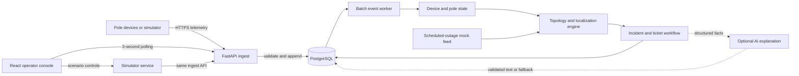

# GridScope Final Product Requirements Document

**Status:** Approved design, ready for implementation planning  
**Date:** 2026-08-03  
**Implementation budget:** 15-20 hours over 7 calendar days  
**Source of truth:** This document supersedes the previous `PRD.md` and
`PRD-claude.md`. The assignment files remain authoritative if a conflict is
discovered.

## 1. Product Summary

GridScope is a fault-detection and operator-console system for one fictional
Karnataka electricity subdivision. It ingests pole liveness telemetry,
distinguishes credible outages from device and scheduled-outage noise,
localizes observable faults to an asset, span, or honest search corridor,
groups symptoms into incidents, manages the required ticket lifecycle, and
verifies restoration from field telemetry.

The primary outcome is to reduce fault occurrence-to-location time from about
two hours to less than 120 seconds at p95 for fault classes that emit enough
evidence. The system must explicitly identify cases where the available data
cannot support that result instead of inventing precision.

## 2. Product Principles

1. **Physics before inference.** Localization is deterministic graph and
   evidence processing. An LLM never decides whether or where a fault exists.
2. **One cause, one incident.** Many downstream dark poles caused by one cut
   must not become many operator alerts.
3. **Silence is unknown.** A silent device may be unpowered or broken. Silence
   alone never proves a power outage.
4. **Evidence before precision.** Report an exact span only when observations
   and topology support it. Otherwise report a corridor or asset-level result.
5. **Operational truth wins.** A human repair report cannot close a ticket;
   fresh restoration telemetry must verify it.
6. **Measure, do not predict.** Performance and inferred-topology accuracy are
   reported from repeatable tests, including failures and segmented results.
7. **Assignment-sized architecture.** Use the smallest system that can meet the
   required scale and public-deployment gates.

## 3. Users and Jobs

### 3.1 Control-room operator

The primary user is a non-engineer working under time pressure, including at
2 a.m. The console must answer, in order:

1. What needs attention now?
2. What asset, span, or corridor is affected?
3. Where should a crew drive, including coordinates and PIN code?
4. How many poles are affected?
5. How certain is the result, and what evidence or uncertainty caused that?
6. What is the ticket status and allowed next action?
7. Did telemetry confirm that the repair restored power?

### 3.2 Evaluator

The evaluator must be able to clone and start the complete seeded system with
one command, open a public URL without credentials, run representative and
edge-case simulations, see the resulting workflow, and understand all design
decisions without asking the author questions.

## 4. Goals, Non-goals, and Success

### 4.1 Goals

- Accept telemetry honestly under duplicate, late, out-of-order, bursty, and
  partially missing delivery.
- Detect and distinguish span, distribution-transformer, feeder, device, and
  planned-outage patterns.
- Localize each credible outage to the narrowest evidence-supported result.
- Handle simultaneous observable faults without merging unrelated faults or
  splitting one upstream cause into dozens of incidents.
- Avoid fault tickets for a lone device failure or a correctly matched
  scheduled outage.
- Create and manage the lifecycle `detected -> acknowledged -> crew_assigned ->
  resolved -> verified -> closed`.
- Auto-verify and close restored incidents using fresh telemetry.
- Provide a focused map-and-list operator console.
- Provide a deterministic, seeded simulator that exercises every required
  fault and noise case through the real ingest path.
- Meet or honestly report the five assignment performance targets.
- Start from a clean clone with `docker compose up` and remain usable without
  optional third-party credentials.

### 4.2 Non-goals

- Crew routing, dispatch optimization, vehicle allocation, or scheduling.
- Production authentication, SSO, or role-based permissions.
- A mobile application.
- Hardware or firmware changes.
- Historical analytics, reporting, or predictive maintenance.
- Multi-subdivision or statewide operation.
- Modelling the HT network beyond feeder-level outage classification.
- LLM-based topology inference, outage detection, localization, confidence, or
  ticket-state decisions.

### 4.3 Required success scenarios

- One span fault produces exactly one correctly localized incident.
- Three simultaneous faults on separate observable branches produce exactly
  three incidents.
- A device failure while power remains available produces no outage ticket.
- A scheduled outage produces no fault ticket.
- Repair telemetry verifies and closes the ticket automatically.
- Reporting a repair while confirmed-dark evidence remains causes visible
  verification failure rather than closure.
- Every incident includes an asset/span/corridor, navigation coordinates, PIN
  code and provenance, affected-pole count, confidence class, and explanation.

## 5. Source Constraints and Scale

The system must be designed against the assignment contract:

| Constraint | Required value or behavior |
|---|---|
| Substations / feeders / DTs / poles | 4 / 31 / 412 / 38,400 in the real subdivision |
| Instrumented poles | 34,900, approximately 91% |
| Telemetry | Approximately 39 msg/s steady; outage bursts in the thousands |
| `power_lost` delivery | Approximately 70% for firmware 1.3 and newer |
| Firmware 1.2.x | Approximately 8%; sends no `power_lost` |
| Unrelated device outage | Approximately 4% of fleet at any moment |
| Heartbeat | Every 15 minutes plus or minus 45 seconds while energized |
| Clock skew | Up to plus or minus 90 seconds across devices |
| Delivery | At least once; retries can be six hours late |
| GPS | Always present, trusted to approximately plus or minus 4 m |
| Missing topology | `parent_pole_id` and `seq_on_line` absent for approximately 60% of DTs |
| Missing PIN | Approximately 3% of pole rows |
| Daily outages | 12-18 typical; up to 120 during monsoon peaks |

No implementation may assume voltage magnitude, current, phase, impedance,
flow direction, wire sensors, customer smart-meter data, road geometry, or a
corrected topology registry.

The combined immediate-observation rate matters. Under the assignment's
independent simulator assumptions, an arbitrary affected pole has approximately
`0.91 device coverage * 0.92 modern firmware * 0.96 normally online * 0.70
dying-message success = 56.3%` probability of producing an immediate usable
`power_lost`. This rises quickly with outage size but remains poor for terminal
one- and two-pole faults. The system therefore cannot use either "one packet is
always a fault" or "two packets are always required" as a universal rule.

## 6. Selected Architecture and Tech Stack

### 6.1 Architecture

GridScope is a modular monolith backed by PostgreSQL. The public deployment is
one web container plus one managed PostgreSQL database. The same application
image serves the API and the pre-built frontend. A lightweight background loop
inside the web process drains a durable PostgreSQL inbox in batches. The inbox
makes accepted telemetry recoverable after a process restart and allows the
worker to be split into a separate process later without changing domain code.

Redis, Kafka, Celery, microservices, WebSockets, Kubernetes, and a separate
frontend deployment are intentionally excluded. They are not needed for the
assignment scale and would consume time on deployment and failure modes that
do not improve localization correctness.

### 6.2 Stack

| Layer | Selection | Reason |
|---|---|---|
| Backend | Python 3.13, FastAPI, Pydantic | Fast iteration, explicit schemas, async I/O, and strong fit for graph/test tooling |
| Persistence | PostgreSQL 18, SQLAlchemy 2, Alembic | Durable inbox, transactions, indexes, JSON evidence, conflict handling, and production-like deployment |
| Graph logic | NetworkX plus small pure-Python domain functions | Proven tree/MST operations without hand-rolling a graph library; domain behavior remains easy to test |
| Frontend | React, TypeScript, Vite | Efficient map/list interaction, explicit types, and a static production bundle served by the API image |
| Map | Leaflet with React Leaflet and OpenStreetMap tiles | API-key-free evaluation path explicitly permitted by the assignment |
| UI updates | HTTP polling every 3 seconds | Easily meets the 120-second requirement and avoids proxy/WebSocket deployment risk |
| Unit/integration tests | pytest | Focused deterministic tests for topology, evidence, localization, tickets, and simulator physics |
| Browser tests | Playwright | Verifies public workflows and measures when tickets become visible in the DOM |
| Load tests | k6 | Reproducible throughput, latency, error-rate, and burst thresholds |
| Packaging | Multi-stage Dockerfile and Docker Compose | One-command clean-clone startup and matching local/deployed runtime |
| Deployment target | Render Docker web service plus Render PostgreSQL | Simple public Docker deployment; free-tier cold start and database expiry must be documented |
| Optional AI | Gemini Developer API, default `gemini-2.5-flash` | Strong English/Kannada wording outside the operational decision path, with a credential-free fallback |

Versions are pinned to tested patch releases during implementation. The major
version floors above are project constraints, not permission to float
dependencies at runtime.

## 7. Domain and Topology Model

### 7.1 Canonical graph

The electrical network is represented as a forest of rooted radial trees:

- Feeder and DT relationships classify higher-level outages.
- Each DT is the root of one LT pole tree.
- Poles are nodes; spans are directed parent-to-child edges.
- A span fault removes one edge and de-energizes that edge's descendant
  subtree.
- A DT fault de-energizes all pole trees under that DT.
- A feeder fault de-energizes all DTs under that feeder.

Topology edges are stored separately from pole assets so source, version,
confidence, and calibration evidence are auditable.

### 7.2 Known topology: approximately 40% of DTs

Where `parent_pole_id` exists, import it as `topology_source=registry`. Validate
that each pole has one parent or is a root child, each parent belongs to the
same DT, no cycles exist, and all poles are reachable from the DT. Invalid
components are quarantined and degraded to DT-level localization; they are not
silently repaired.

Known topology supports an exact span only when the observation boundary is
adjacent and sufficiently observed. Missing devices can still force a corridor.

### 7.3 Missing topology: approximately 60% of DTs

Inference runs independently per DT at import time:

1. Add the DT as the root and use trusted GPS coordinates for all member poles.
2. Build a sparse undirected candidate graph from each node's nearest
   geographic neighbors. Use a maximum candidate length derived from the known
   topology's measured span-length distribution; retain a longer fallback edge
   only when required to keep the graph connected.
3. Weight candidates primarily by haversine distance. Do not add path-dependent
   angle costs to an ordinary edge-weight algorithm.
4. Compute a minimum spanning tree using NetworkX.
5. Orient the tree away from the DT with breadth-first traversal. Do not require
   every child to be farther from the DT than its parent because real lines can
   curve or briefly backtrack.
6. Store the inferred parent, selected-edge length, alternative-edge margin,
   and `topology_source=inferred`.

This produces a usable working topology, not ground truth. Geographic nearest
neighbors can be on opposite roads or separated by buildings, and the true
wire may follow a right-of-way not present in the registry.

### 7.4 Calibration and output gating

The synthetic generator always creates and retains a complete hidden
ground-truth topology. It then blanks topology fields for 60% of exported DTs.
The inference service may see only the same fields available in production.

Calibration has two separate reports:

1. **Synthetic masked-topology benchmark:** compare inferred edges and simulated
   fault localization against hidden truth for the blanked synthetic DTs.
2. **Production method proposal:** on real deployment data, mask a holdout from
   the known 40% and repeat the benchmark. Synthetic accuracy must never be
   described as measured real-world accuracy.

Metrics are undirected edge precision/recall, exact-span localization
precision, corridor containment rate, and proportion degraded to corridor or
DT level. The console may label an inferred span `high confidence` only if the
held-out high-confidence bucket achieves at least 90% exact-span precision.
If it does not, inferred outputs are limited to corridors or DT-level results.

### 7.5 Missing-device corridor

When direct observations do not make the boundary adjacent, return the path
between the nearest evidence-supported live endpoint and first confirmed-dark
endpoint. Name all intervening poles and spans. The navigation coordinate is
the midpoint of the corridor geometry, and the map highlights the full
corridor. Never mark an unobserved pole dark merely because a descendant is
dark; a fault may lie on the intervening span.

### 7.6 PIN-code resolution

PIN source and provenance are required on every incident:

1. Use the downstream boundary pole's registry PIN when present.
2. Otherwise use the nearest pole with a PIN inside the same DT.
3. For a DT or feeder asset, use the nearest member pole with a PIN.
4. If synthetic corruption removes all usable PINs in the scope, use the
   generator's bounded offline PIN lookup derived from the seeded service area.

The UI labels fallback values `nearest-registry` or `offline-inferred`. The
public deployment never requires a reviewer's geocoding API key.

## 8. Telemetry Ingestion and State

### 8.1 Ingest contract

`POST /api/v1/telemetry` accepts the assignment payload. A batch endpoint uses
the same validation path for simulator and load tests. Valid accepted events
are durably appended and receive HTTP 202; malformed or unknown-asset payloads
receive a structured 4xx response and are not allowed to affect state.

The ingest request does only validation, exact-duplicate detection, and durable
append. It does not synchronously run localization.

### 8.2 Exact duplicates and sequence resets

`(device_id, seq)` is insufficient as a global unique key because `seq` resets
after `boot`. The system therefore uses two layers:

- A canonical payload fingerprint detects byte-equivalent retries without
  confusing a later boot epoch with an earlier one.
- Per-device stream state tracks an inferred boot epoch, last accepted sequence,
  last device timestamp, and last receive timestamp.

A `boot` with sequence zero opens a new epoch only when its timestamp is
plausibly newer than the current epoch within the 90-second skew allowance. A
late replayed boot remains stored as evidence but cannot reset current state.
After a boot, high-sequence messages timestamped before that boot are treated as
stale prior-epoch retries. Device timestamps order messages only within one
device after skew checks; cross-device detection uses server receive windows.

### 8.3 Device swaps and registry mismatch

Pole state is keyed by `pole_id`, while device stream state is keyed by
`device_id`. A payload whose device is currently assigned to a different pole
is quarantined for review rather than moving either asset automatically. The
schema supports effective-dated device assignments so a later registry import
can represent real swaps.

### 8.4 Evidence states

Each pole has a current evidence state, provenance, and freshness:

- `confirmed_live`: fresh accepted heartbeat, boot, or restoration event with
  `energized=true`.
- `confirmed_dark`: fresh accepted `power_lost` with `energized=false`.
- `unknown_silent`: expected telemetry is absent; this is not dark evidence.
- `uninstrumented`: no active device is assigned.
- `device_suspect`: contradictory topology pattern, poor radio history, or
  isolated device behavior indicates a sensor problem.

Pre-fault heartbeat state is retained as weaker last-known evidence. A 15-minute
timeout may change device health to silent but may not create an outage ticket
by itself.

### 8.5 Evidence-tiered reliability policy

The optimized policy adds no new infrastructure. It is implemented by the same
event worker with one small `detection_candidates` table and three evidence
tiers:

1. **Tier 0 - baseline health:** before any incident, heartbeat history, firmware,
   RSSI, battery, device assignment, and pre-existing offline status establish
   which sensors were already unreliable. The baseline is context only; it is
   never outage evidence.
2. **Tier 1 - investigating:** one current, internally consistent `power_lost`
   creates an internal candidate immediately and opens the 30-second settle
   window. It does not create an operator fault ticket by itself.
3. **Tier 2 - actionable:** promote to a fault ticket when the window contains
   either two topologically consistent direct dark reports, one direct dark
   report plus a post-onset confirmed-live adjacent parent, or the DT/feeder
   coverage quorum in Section 9.3. A single report with confirmed-live children
   becomes a device issue instead.
4. **Refinement:** later eligible evidence may narrow a corridor, raise or lower
   confidence, roll DT incidents into a feeder incident, or reject the
   hypothesis. Every change is appended to the audit trail.

A Tier-1 candidate that receives no corroboration within 120 seconds becomes a
device-health anomaly rather than a dispatch ticket. This deliberately favors
operator trust over pretending that a terminal one-pole outage and a failed
sensor can always be distinguished.

#### Unified operational decision rule

Create a fault ticket only when timely, valid, topology-consistent direct dark
evidence is sufficiently corroborated **and** no stronger non-fault explanation
fits. This is the single rule behind the detailed policies in Sections 8-11;
the sources are considered together, not as independent alarms.

1. Validate the event stream first: device-to-pole assignment, payload
   fingerprint, boot epoch, sequence order, clock-skew bound, and 180-second
   real-time eligibility.
2. Interpret a current `power_lost` as direct dark evidence; interpret
   heartbeat, `boot`, and `power_restored` as live or restoration evidence;
   treat silence, RSSI, and battery only as health, reliability, or confidence
   context. They never prove an outage.
3. Group valid observations by receive-time window and topology, preserving
   uninstrumented, offline, and silent poles as unknown gaps. Require the
   Tier-2 corroboration above before dispatching.
4. Test competing explanations before promotion: a matching observed scheduled
   operation, an isolated device failure, fresh live contradiction, or stale
   replay defeats the outage hypothesis. A schedule record by itself never
   suppresses telemetry.
5. Localize only to the narrowest boundary justified by the surviving evidence:
   exact span, containing corridor, DT, feeder, or no dispatch ticket. Use
   topology provenance and evidence coverage to set confidence.

Consequences are intentional: not every downstream device must restore or
report dark for a real outage to be ticketed; representative direct reports on
the affected branches can suffice. Conversely, an uncorroborated dark event,
pure silence, an entirely uninstrumented span, or a real fault exactly matching
an active planned-outage scope may remain an anomaly or be temporarily
indistinguishable rather than being presented as a confident fault.

All valid events are stored, but only real-time-eligible events can create or
rewind operational state. The default eligibility rule is:

- Device time may be at most 90 seconds ahead of server receive time.
- `received_at - ts` may be at most 180 seconds for a new detection trigger.
- Older retries remain immutable audit evidence and may annotate an already
  matching incident, but cannot create a new ticket, reopen a closed ticket, or
  overwrite newer pole state.
- Within one boot epoch, `seq` decides order. Across devices, the settle window
  uses `received_at`, not device timestamps.

The 180-second value is a documented assignment assumption: it includes the
90-second clock-skew bound and ordinary delivery delay while excluding retries
that already cannot satisfy the two-minute objective. It is configuration, not
a hidden constant.

### 8.6 Messy-reality cascade controls

| Field condition | How it can cascade into a wrong result | Required control | Residual limitation | Proof |
|---|---|---|---|---|
| Capacitor permits one dying packet and delivery succeeds only about 70% | Missed upstream reports can move the apparent boundary downstream; evaluating each packet can split one outage into many tickets | Tier-1 candidate, 30-second settle, topological grouping, corridor across unobserved nodes, later refinement | Very small outages may not emit enough evidence | Packet-drop scenarios at multiple subtree sizes |
| Heartbeat only every 15 minutes plus or minus 45 seconds | Treating silence as immediate darkness creates false tickets from normal heartbeat gaps; waiting for timeout misses the 120-second goal | Event-driven detection; heartbeat supplies baseline and weak last-known-live context only; silence never promotes a ticket | Firmware-1.2 terminal outage is not promptly observable | Random heartbeat phase plus firmware-1.2 scenarios; segmented p95 |
| Approximately 9% of poles have no device | A fault between uninstrumented poles can be assigned to the wrong adjacent span; affected and restoration sets can be overstated | Preserve gaps, return the full live-to-dark corridor, include uninstrumented assets in estimated downstream count, verify from representative reporting branches | No telemetry can identify which span inside a fully uninstrumented corridor failed | Boundary with one and multiple consecutive uninstrumented poles |
| Approximately 4% of devices are already offline | Baseline dead modems can be counted as new dark poles, widening or inventing an outage | Snapshot pre-incident health; classify them `unknown_silent`; exclude them from direct-dark numerator and show them in confidence breakdown | A real outage occurring behind only offline devices remains hidden | Seeded 4% baseline plus noise-only and real-fault runs |
| Device fails while power is live | A lone sensor event or silence can create a false crew dispatch | Require Tier-2 corroboration; live descendants contradict a line fault; route isolated behavior to device health | A terminal leaf sensor failure and terminal span fault can be identical | Device-death and ambiguous-leaf scenarios |
| Clock skew is plus or minus 90 seconds and downstream can arrive first | Timestamp sorting can reverse the physical sequence, split an incident, or select the wrong root | Per-device `seq`, boot epochs, server receive-time grouping, bounded settle, idempotent re-evaluation | Exact cross-device occurrence order is unknowable | Downstream-first and maximum-skew scenarios |
| At-least-once retries can arrive six hours late | A stale `power_lost` can rewind a restored pole, reopen a ticket, or create a phantom outage | Canonical fingerprint, per-device epoch ordering, 180-second trigger eligibility, audit-only stale events | A genuinely delayed event older than the limit cannot be treated as real time | Exact duplicate, stale retry, boot reset, and conflicting-sequence scenarios |
| Scheduled shutdown starts late or overruns 20-40 minutes | Hard timing can falsely alert on maintenance or suppress a real partial fault | Match both topology scope and observed timing; no pre-start suppression; permit end grace; evaluate scope mismatches independently | A real fault exactly matching the planned scope is initially indistinguishable | Late-start, overrun, partial-scope, and exact-scope scenarios |
| Roughly one in ten scheduled outages is cancelled without feed correction | Treating schedule as truth can hide an unrelated fault during a window that never switched off | A schedule record alone changes nothing; suppression begins only when matching dark telemetry appears; no telemetry means no planned-operation observation | A coincident real fault with exactly the scheduled scope remains indistinguishable until non-restoration | Cancelled schedule with no fault, unmatched fault, and exact-scope fault |
| Topology is absent for approximately 60% of DTs | Wrong edges can mislocalize spans, split/merge incidents, miscount affected poles, and verify against the wrong subtree | Per-DT inference, hidden-truth calibration, high-precision output gate, inferred label, corridor/DT fallback, topology versioning | Geography cannot reveal roads, crossings, or real wire routing | Masked-topology benchmark and low-margin scenarios |

### 8.7 Durable worker behavior

The worker claims inbox rows in batches, processes them transactionally, and
marks them processed only after state and incident effects commit. A process
restart replays unprocessed rows. Incident writes are idempotent. Backlog age
and count are exposed by the health API and recorded during performance tests.

## 9. Detection, Localization, and Grouping

### 9.1 Detection window

The first real-time-eligible `power_lost` creates a Tier-1 candidate and
schedules evaluation for the affected DT after a 30-second settle window.
Additional events extend neither the window beyond 45 seconds nor create
per-message tickets. At evaluation, only Tier-2 evidence creates a fault ticket.
Evidence can refine an open incident after initial creation without replacing
its audit history.

### 9.2 Boundary candidates

For each affected tree:

1. Collect confirmed-dark observations received in the incident window.
2. Preserve unknown and uninstrumented nodes as gaps rather than imputing them.
3. Remove dark descendants already explained by a better-supported dark
   ancestor.
4. For each remaining dark evidence root, walk upstream to the nearest
   evidence-supported live point or DT root.
5. Produce an exact span when those endpoints are adjacent; otherwise produce
   the full intervening corridor.
6. Merge candidates whose dark observations are explained by one supported
   upstream cut. Keep candidates separate when they occur on different branches
   and no single supported cut explains both.

Affected-pole count is the total downstream asset count from the selected
boundary, including uninstrumented poles. In inferred topology it is labeled an
estimate. No household estimate is shown for span faults because household
distribution by pole is not provided.

### 9.3 Fault classification

| Classification | Evidence rule | Operator result |
|---|---|---|
| Span | Supported live-to-dark transition within one DT branch | Exact span or corridor |
| DT | Broad, near-simultaneous dark evidence across independent first-level branches under one DT, with no credible live contradiction | DT asset and coordinates |
| Feeder | Broad, near-simultaneous DT-level patterns across multiple DTs on one feeder, with no credible live contradiction | Feeder asset plus affected DTs |
| Device issue | An isolated dark pole has confirmed-live descendants, contradictory sequence data, or isolated telemetry failure without outage corroboration | Device-health record; no outage ticket |
| Planned outage | Observed pattern and timing fit a scheduled scope under Section 10 | Planned-operation record; no fault ticket |
| Ambiguous | Evidence cannot separate terminal span failure, lamp circuit failure, and device failure | Low-confidence anomaly; no dispatch fault ticket until corroborated |

DT and feeder classification uses configurable evidence coverage rather than
requiring every device to report:

- A DT fault requires direct dark evidence on at least two independent
  first-level branches, or on every observable branch when the DT has fewer than
  two instrumented branches, with no fresh live contradiction.
- A feeder fault requires qualifying DT-level patterns on at least
  `max(2, ceil(60% of feeder DTs))` within the same receive-time window, with no
  broad fresh-live contradiction. Two coincident DT faults on a larger feeder
  therefore remain two DT incidents.

For a single-branch DT, loss of the DT and loss of the first span can produce
the same observation. Report `DT supply or root-span` as an asset/corridor
result unless independent evidence separates them. Exact thresholds are stored
in configuration and exercised by tests.

### 9.4 Multiple faults and observability limits

Separate branches can produce separate boundaries. Faults on the same
root-to-leaf path are not independently observable while the upstream fault has
already darkened the downstream segment. The system creates the upstream
incident; after upstream restoration, any remaining dark subtree is evaluated
as a new or linked downstream incident. The UI and documentation must state
this physical limit.

A silent firmware-1.2 leaf cannot distinguish a terminal outage from modem
failure within 120 seconds. Likewise, a lone reporting leaf can be ambiguous
between a terminal span failure and its own lamp/sensor circuit. These cases
remain non-dispatch anomalies unless corroborated. They are measured separately
and excluded only from the achievable-fault p95 with the exclusion clearly
reported.

### 9.5 Incident correlation

An open incident has a stable correlation key based on fault class and current
boundary scope. Repeated evidence updates that incident rather than creating a
duplicate. If later evidence moves an initial corridor to an exact span, retain
the original hypothesis and append a `location_refined` ticket event. Feeder
roll-up supersedes matching open DT incidents; it links rather than deletes
them, preserving auditability.

### 9.6 Location output

- Exact span: midpoint between parent and child GPS coordinates.
- Corridor: midpoint along the highlighted path, with both endpoint coordinates
  and all candidate spans available in detail.
- DT fault: transformer registry coordinates.
- Feeder fault: coordinates of the affected DT cluster centroid plus the list
  of member DT locations; the UI never represents a feeder as one exact broken
  point.

### 9.7 Confidence model

Confidence is categorical (`high`, `medium`, `low`), not a pseudo-probability.
Every result includes a machine-readable and human-readable breakdown:

- Topology source: registry or inferred.
- Topology validation result and inferred-edge ambiguity.
- Boundary precision: adjacent span, multi-span corridor, or asset level.
- Direct evidence count and downstream coverage.
- Unknown, silent, offline, and uninstrumented devices in the affected scope.
- Fresh live contradictions, if any.
- Scheduled-outage overlap.

`high` requires registry topology or a calibrated high-precision inferred
bucket, Tier-2 evidence, an adjacent boundary, post-onset live support, and no
contradiction. `medium` permits one material uncertainty such as inferred
topology, only pre-onset last-known-live support, or a short corridor. `low`
applies to asset-level degradation, weak coverage, conflicting evidence, or
multiple uncertainties. Operators see the class and the two most important
reasons; details show the complete breakdown.

## 10. Scheduled Outages

Scheduled outages are soft evidence, but the acceptance behavior is strict:
they must not produce fault tickets when observed telemetry matches the planned
scope and timing.

1. Poll and cache the mocked scheduled-outage feed.
2. Match observed timing and topology against the listed feeder or DT scope.
3. Apply no pre-start suppression. A matching outage may begin at any point
   inside its published window and may remain planned through 40 minutes after
   the published end, matching late starts and the brief's 20-40 minute
   overruns.
4. If the outage pattern fits, create or update a planned-operation record and
   keep it out of the active fault queue.
5. If the observed boundary is outside or materially smaller than the scheduled
   scope, evaluate the unmatched portion as a possible real fault.
6. If power remains dark after `scheduled_end + 40 minutes`, promote the
   observation to a fault incident and alert the operator.
7. If a listed outage is silently cancelled and power remains live, create
   neither a fault nor a false outage observation. The schedule record alone
   never suppresses anything.
8. If the feed is unavailable, use only a cached record whose own time window is
   still current and mark schedule confidence reduced. With no applicable
   cached record, evaluate telemetry as unscheduled rather than suppressing it.

A real fault perfectly coincident with the same planned scope is not
distinguishable until non-restoration or contradictory evidence appears. This
is an explicit data limitation, not hidden behavior.

## 11. Ticket Workflow and Restoration

### 11.1 Lifecycle

| State | Entered by | Exit rule |
|---|---|---|
| `detected` | Detection engine | Operator acknowledges |
| `acknowledged` | Operator | Operator records crew assignment |
| `crew_assigned` | Operator | Operator reports repair, or fresh restoration evidence opens system resolution |
| `resolved` | Operator repair report or restoration engine | Telemetry verifies or rejects resolution |
| `verified` | Restoration engine only | System closes automatically |
| `closed` | System only | Terminal; later relapse creates linked incident |

Every transition creates an immutable ticket event with timestamp, actor,
reason, and relevant evidence IDs. A hardcoded operator identity is sufficient.

### 11.2 Repair report pushback

If an operator reports resolution while fresh confirmed-dark evidence remains,
the API records the attempted report, returns a conflict response, keeps the
ticket at `crew_assigned`, and displays which poles still report dark. It does
not pretend the repair succeeded.

### 11.3 Restoration verification

Verification begins when `resolved` is entered after a valid repair report or
when sufficient fresh restoration evidence moves a `crew_assigned` ticket into
`resolved` automatically. The standard demo exercises the complete ordered
lifecycle.

- Fresh `boot` and `power_restored` events with `energized=true` are direct
  restoration evidence; a later 15-minute heartbeat is not required.
- The boundary's first previously dark reporting pole must restore.
- For a larger subtree, at least one representative reporting pole on each
  previously observed dark branch must restore.
- No fresh confirmed-dark contradiction may remain.
- Evidence must remain stable for 30 seconds before entering `verified`.
- The system immediately advances `verified` to `closed` while retaining both
  events in history.

Uninstrumented or silent poles do not block verification when all available
representative evidence is restored, but they reduce the verification
confidence explanation. A relapse after closure creates a linked new incident
rather than mutating history.

## 12. Operator Console

### 12.1 Primary screen

The first viewport is the operational workspace, not a landing page. It has a
stable split layout: priority-sorted incident list and geographic map, with a
compact status bar for ingest health, active faults, planned operations, and
oldest unprocessed event age.

The list prioritizes unacknowledged incidents, then affected-pole count, then
age. Each row shows fault class, exact/corridor/asset location, PIN, affected
poles, confidence, age, and workflow status. Color is never the only status
signal.

The map initially renders active incident markers and highlighted spans or
corridors, not thousands of pole markers. Selecting a list row focuses the map;
selecting a map feature opens the same incident detail. A network overlay may
load only for the selected incident scope.

### 12.2 Incident detail

Detail shows:

- What likely failed and the navigation coordinates.
- Exact span, corridor candidates, DT, or feeder scope.
- PIN and PIN provenance.
- Affected-pole count and topology source.
- Confidence class, top reasons, and complete evidence breakdown.
- Confirmed-live, confirmed-dark, unknown, and uninstrumented counts.
- Evidence timeline and every hypothesis refinement.
- Ticket history and only the actions allowed from the current state.
- Verification progress or explicit repair-report rejection.

### 12.3 Planned operations and device health

Planned outages are visible in a separate compact view and do not appear as
fault tickets. Device-health anomalies are accessible but visually secondary
to power incidents, preventing sensor maintenance noise from dominating the
2 a.m. workflow.

### 12.4 Simulator experience

Simulator controls live in a clearly labeled `Demo` view so simulated actions
cannot be mistaken for operator workflow. It offers scenario presets, run
progress, expected outcome, repair, and reset. Every generated incident is
labeled with its simulator run ID.

### 12.5 Required states

The console includes loading, empty, stale-data, API-unavailable, ingest-backlog,
low-confidence, and cold-start states. Layout must remain usable at common
desktop sizes and a narrow reviewer viewport. Keyboard focus, readable contrast,
and text labels accompany unfamiliar icons.

## 13. Simulator and Synthetic Data

### 13.1 Seed network

On first startup, an idempotent seeded generator creates a deterministic network
large enough to evaluate behavior without reproducing all 38,400 poles:

- 4 substations, 12 feeders, 60 DTs, and approximately 4,200 poles.
- Pole counts vary from 9 to 240 per DT with median near 70.
- Radial main lines plus one to five branches, with realistic lengths and turns.
- 91% device coverage, 60% exported topology missing, 3% missing PIN, 8%
  firmware 1.2.x, and 4% independently offline devices.
- Randomized heartbeat phase across the 15-minute plus or minus 45-second
  interval so silence tests cannot rely on synchronized heartbeats.
- Battery and RSSI distributions that influence message loss while preserving
  the required approximately 70% aggregate dying-message success.
- Full hidden topology retained solely for simulator truth and evaluation.
- A fixed random seed makes failures reproducible.

The topology generator creates branch polylines and then samples poles along
them. It must not call the production MST inference algorithm, which would make
calibration circular.

### 13.2 Fault physics

- Span fault: all instrumented descendants lose power; firmware 1.3+ devices
  attempt one `power_lost`, independently dropped 30% of the time; firmware
  1.2.x devices become silent.
- DT fault: the same behavior applies to every pole under the selected DT.
- Feeder fault: the same behavior applies to every pole under every selected
  feeder DT.
- Repair: affected devices emit `boot` and `power_restored`, usually within 20
  simulated seconds; ordering and duplication noise may still apply.
- Device death: only that device stops reporting while electrical state and
  downstream devices remain energized.

The simulator posts generated messages through the public ingest contract and
never creates incidents or edits pole state directly.

### 13.3 Required scenarios

1. Exact span fault on known topology.
2. Span fault on confidently inferred topology.
3. Weak inferred topology that degrades to a corridor or DT.
4. Span boundary containing one or more consecutive uninstrumented poles,
   including a candidate span whose two endpoint poles have no device.
5. DT fault.
6. Feeder fault.
7. Three simultaneous faults on distinct branches of one DT.
8. Two same-path faults demonstrating the observability limitation.
9. Device death while downstream power remains live.
10. Firmware-1.2-only terminal silence.
11. Scheduled outage starting late, overrunning, or being cancelled.
12. Real unmatched fault during a scheduled-outage window.
13. Duplicate, out-of-order, clock-skewed, and six-hour-stale delivery.
14. Device reboot with sequence reset and stale pre-boot replay.
15. Repair, telemetry verification, auto-close, and post-close relapse.
16. Four-percent pre-existing offline baseline combined with both noise-only and
    real-fault telemetry.
17. One uncorroborated dying packet that expires to a device-health anomaly and
    one candidate that is promoted by corroborating evidence.

Each preset declares its expected number and class of incidents. The UI shows a
pass/fail comparison after the run. A documented command can execute the same
scenario set headlessly.

## 14. AI Feature

After deterministic incident creation, an optional asynchronous service turns
persisted, deterministic incident facts into concise plain English and Kannada
wording. Its input contains only already-computed asset IDs, location, affected
count, confidence breakdown, and workflow state. Its output is schema-validated,
and protected asset IDs and numbers must match the input exactly.

Rules:

- Default model: `gemini-2.5-flash` through the Gemini Developer API.
- One request on incident creation and one only when location or confidence
  materially changes; never one request per telemetry message.
- A five-second timeout, API error, missing key, invalid schema, or unsupported
  statement uses a deterministic bilingual template.
- The database stores model name, prompt version, token usage, latency, and
  whether fallback was used.
- AI text cannot modify incident facts, confidence, classification, location,
  severity, or ticket state.
- The deployed app remains fully usable when `GEMINI_API_KEY` is absent. The
  reviewer never supplies a key.
- No grounding or search is used: GridScope's persisted incident facts are the
  only source of truth. Gemini's free tier is demo-only; its data-use terms must
  be reviewed before sending non-public production data.
- `ARCHITECTURE.md` reports measured average tokens and cost per explanation
  using pricing current at implementation time.

This feature is useful for plain-language and bilingual communication, where
wording varies, while deterministic code retains every safety-relevant decision.

## 15. API Surface

All application endpoints are under `/api/v1`; OpenAPI is generated from the
FastAPI schemas.

| Method and path | Purpose |
|---|---|
| `POST /telemetry` | Validate and durably accept one device event |
| `POST /telemetry/batch` | Accept simulator/load-test batches through the same pipeline |
| `GET /incidents` | Paginated/filterable incident list |
| `GET /incidents/{id}` | Incident, confidence, evidence, location, and ticket history |
| `POST /incidents/{id}/acknowledge` | `detected -> acknowledged` |
| `POST /incidents/{id}/assign` | Record crew label and enter `crew_assigned` |
| `POST /incidents/{id}/report-resolved` | Request resolution; reject while confirmed dark |
| `GET /planned-operations` | Current and recent matched scheduled outages |
| `GET /device-health` | Paginated sensor anomalies, secondary to incidents |
| `GET /network/incidents/{id}` | GeoJSON for selected span, corridor, or asset scope |
| `GET /simulator/scenarios` | List deterministic scenario presets and expected outcomes |
| `POST /simulator/runs` | Start a scenario with optional noise overrides |
| `GET /simulator/runs/{id}` | Run progress and expected-vs-actual result |
| `POST /simulator/runs/{id}/repair` | Repair the selected simulated fault |
| `POST /simulator/reset` | Restore the deterministic clean seed state |
| `GET /health` | Process liveness |
| `GET /ready` | Database, seed, worker, and backlog readiness |

Mutation responses include the resulting resource and typed error codes. List
endpoints are indexed and paginated. Simulator mutations are enabled because
the assignment dataset is synthetic; the production adaptation would disable
them.

## 16. Data Model

| Entity | Key responsibilities |
|---|---|
| `substations`, `feeders`, `transformers`, `poles` | Asset registry and trusted coordinates |
| `topology_edges` | Parent/child, source, version, distance, ambiguity, calibration bucket |
| `devices`, `device_assignments` | Firmware, health, and effective-dated pole binding |
| `telemetry_events` | Immutable payload, fingerprint, receive time, processing state, epoch decision |
| `device_stream_state` | Current epoch, sequence, device time, and receive time |
| `pole_evidence_state` | Latest evidence class, source event, freshness, and device health |
| `detection_candidates` | Tier-1 scope, first receive time, expiry, evidence links, and promotion outcome |
| `scheduled_outages` | Mock feed records and configured grace windows |
| `planned_operations` | Observed patterns matched to schedules; never fault tickets |
| `incidents` | Fault class, status, location, PIN, affected count, confidence, correlation, simulation ID |
| `incident_boundaries` | Exact edge or corridor endpoints and candidate spans |
| `incident_evidence` | Links between incidents and immutable telemetry evidence |
| `ticket_events` | Immutable lifecycle, refinement, verification, and rejection history |
| `simulator_runs`, `simulated_faults` | Seed, truth, scenario, timing, repair, expected and actual results |
| `ai_explanations` | Prompt/model metadata, validated text, usage, latency, and fallback reason |

Important constraints include unique telemetry fingerprints, foreign keys for
asset membership, indexes on inbox processing state and receive time, indexes
on active incident status and update time, and an idempotent active-incident
correlation key.

## 17. Error Handling and Operational Safety

- Invalid telemetry is rejected with field-level errors; unknown devices or
  pole mismatches are quarantined and counted.
- A database failure returns service-unavailable rather than acknowledging data
  that was not persisted.
- Worker failure leaves rows unprocessed for replay after restart.
- Detection exceptions attach a failed processing reason and remain retryable;
  poison events cannot block later batches.
- Scheduled-feed failure retains the last successful snapshot, marks it stale
  in the UI, and lowers confidence instead of hard-suppressing faults.
- Map-tile or AI failure degrades visibly without breaking incidents or ticket
  actions.
- Seed and migrations are idempotent and protected against concurrent startup.
- Logs use correlation IDs and exclude secrets. No credentials or live keys are
  committed.

## 18. Verification and Test Strategy

### 18.1 Localization tests: highest priority

- Known topology plus a known fault returns the expected exact span.
- Downstream symptoms collapse into one incident.
- One uncorroborated current `power_lost` creates a candidate but no fault ticket.
- Corroborating topology-consistent evidence promotes that candidate once.
- Three independent branch faults return exactly three incidents.
- Same-path faults expose only the observable upstream cut until restoration.
- Missing boundary devices produce a containing corridor.
- Known DT and feeder faults classify at their asset levels.
- Isolated dark-with-live-descendants becomes a device issue.
- Silent firmware-1.2 leaf produces no false outage ticket.
- Four-percent pre-existing offline devices remain unknown and do not widen the
  direct-dark boundary.
- Weak inferred topology degrades rather than asserting a span.
- Scheduled outage creates no fault ticket and escalates only after grace.
- Real evidence outside a scheduled scope remains eligible for a fault.

### 18.2 Ingest and state tests

- Exact retry is idempotent.
- An event older than the 180-second real-time limit is stored but cannot create,
  reopen, or rewind an incident.
- Out-of-order same-epoch sequence cannot rewind pole state.
- Fresh boot opens an epoch; stale replayed boot does not.
- Stale high-sequence pre-boot retry cannot overwrite post-boot state.
- Device/pole mismatch is quarantined.
- Worker restart replays accepted unprocessed events exactly once at the domain
  effect level.

### 18.3 Ticket and restoration tests

- All valid lifecycle transitions work and invalid transitions fail.
- Resolution report with dark evidence is recorded and rejected.
- Representative fresh restoration evidence plus 30-second stability verifies
  and closes automatically.
- Unknown poles reduce confidence but do not require a 15-minute heartbeat.
- Relapse creates a linked incident.

### 18.4 End-to-end tests

Playwright drives the Demo view through span injection, detection, ticketing,
acknowledgement, assignment, repair, auto-verification, and closure. Separate
tests cover three faults, dead device, scheduled outage, and low-confidence
corridor. Tests assert visible DOM state, not only API responses.

## 19. Performance Validation

No target is claimed until the specified command has run against the seeded
Docker stack and its raw summary is committed or copied into
`ARCHITECTURE.md`.

| Required metric | Test method and pass condition | Design latency budget |
|---|---|---|
| Fault occurrence to localized ticket visible | At least 100 deterministic achievable-fault runs across span, DT, feeder, known/inferred topology, noise, and branch sizes; Playwright records injection time to rendered incident; p95 `<120s` | 30s settle + <=5s worker/backlog + <=3s poll; nominal under 45s |
| Sustained ingest | k6 sends at least 500 single-event requests/s for 60s; accepted unique count matches persisted count, HTTP failure rate `<1%`, no data loss, backlog drains within 60s | Fast append path and batched worker |
| Burst tolerance | k6 sends exactly 5,000 events over 10s with duplicates and mixed devices; all valid unique events persist and backlog drains without loss | Durable PostgreSQL inbox absorbs burst |
| Incident-list load | Playwright measures navigation to usable list on seeded data over 30 cold and warm runs; p95 `<2s`, excluding separately reported host cold start | Paginated indexed query; active incidents only; no full-pole map render |
| Restoration to auto-verified | At least 100 repair runs; simulator repair time to visible `verified/closed`; p95 `<120s` | Events within 20s + 30s stability + <=3s poll; nominal under 60s |

Additional reported metrics:

- Ingest API p50/p95/p99 latency and error rate.
- Oldest and maximum inbox backlog age.
- Exact-span precision for known topology under noise.
- Inferred-topology edge precision/recall, exact-span precision, corridor
  containment, and degradation rate.
- False fault-ticket count across at least 100 noise-only simulator runs.
- Results segmented by firmware 1.2 terminal silence and other unobservable
  cases; no blended p95 may hide the approximately 15-minute information floor.
- Public-host cold-start time is measured separately from warm console load.

Accuracy and reliability gates accompany the latency targets:

| Quality metric | Pass condition |
|---|---|
| Required deterministic scenarios | Exact expected incident count and class in every run |
| Known-topology exact-span precision under injected noise | At least 95% for results labeled high confidence |
| Inferred-topology exact-span precision | At least 90% in the bucket allowed to display an exact span; otherwise disable exact inferred output |
| Corridor containment | At least 95% of reported corridors contain the hidden true failed span |
| False outage tickets from device death, baseline offline devices, stale retries, and matched schedules | Zero across each required deterministic scenario and zero across at least 100 seeded noise-only runs |
| Grouping | One upstream cut produces one incident; the three-branch scenario produces exactly three |

These are precision gates, not permission to hide recall. The report also states
how many injected faults remained candidates, degraded to corridors, or were
unobservable, split by subtree size, firmware, coverage, and topology source.

If a target is missed, the submission reports the measured value, environment,
likely bottleneck, and chosen tradeoff. It never substitutes an expected number.

## 20. Deployment and Reproducibility

### 20.1 Clean clone

`docker compose up` must build the frontend, start PostgreSQL and the web
container, wait for database readiness, apply migrations, seed the deterministic
network when absent, and expose the complete app. No manual migration, separate
service command, or config edit is allowed. Safe defaults live in Compose and
every override is documented in `.env.example`.

### 20.2 Public deployment

The target deployment is one Docker web service and managed PostgreSQL on
Render. The frontend is built into and served by the web image, eliminating
CORS and cross-service frontend configuration. The README must disclose that a
free Render web service can take about one minute to cold-start after 15 idle
minutes and that free Render PostgreSQL expires after 30 days. The deployment
must be recreated or upgraded early enough to remain available through review.

The public app opens without login, invite, VPN, reviewer API key, or reviewer
environment variables. Before submission it is tested in a private browser
window.

### 20.3 Required root documents

Implementation produces the five assignment documents:

- `README.md`: one-command start, public URL, demo link, and documentation map.
- `ARCHITECTURE.md`: matching diagram, ingest semantics, schemas, localization,
  complexity, missing topology, confidence, API, UI reasoning, AI behavior,
  measured performance, and known failures.
- `DEPLOYMENT.md`: versions, exact commands, every environment variable,
  verification, clean reset, and troubleshooting based on real failures.
- `DECISIONS.md`: newest-first decisions, rejected alternatives, assumptions,
  current fragility, cuts, and two-more-weeks plan.
- `AI-WORKFLOW.md`: tools and delegation, AI mistakes caught, discarded output,
  estimated AI-authored code, and useful prompt/session excerpts.

The repository also includes generated OpenAPI, `.env.example`, meaningful
incremental commits, lint/format commands, and no secrets.

## 21. Execution Order and Time Budget

| Workstream | Budget | Exit condition |
|---|---:|---|
| Repository, Compose, schema, seed startup | 2h | Clean app starts and shows seeded status |
| Synthetic generator and hidden truth | 2.5h | Required proportions and deterministic scenarios exist |
| Topology, calibration, and localization tests | 4h | Core fault/noise matrix passes |
| Ingest, evidence state, tickets, restoration | 3h | Idempotent end-to-end backend workflow passes |
| Operator console and simulator UX | 3h | Reviewer can run and understand full workflow |
| Performance, deployment, and failure fixes | 2.5h | Targets measured locally and public URL verified |
| Documents and five-minute demo | 2h | All gates and submission self-check pass |
| **Total** | **19h** | Submission ready |

If time slips, cut in this order:

1. AI-generated wording while retaining the deterministic bilingual fallback
   and documented no-LLM argument.
2. Nonessential network overlays and visual polish beyond the core map/list.
3. Advanced simulator parameter editing while retaining every scenario preset
   and headless command.

Never cut localization tests, missing-topology behavior, scheduled-outage and
device-noise cases, restoration verification, one-command startup, public
deployment, required documents, or demo video.

## 22. Acceptance Gates and Traceability

| Assignment requirement | PRD coverage | Final proof |
|---|---|---|
| Ingest duplicates, ordering, failure, bursts | Sections 8, 17, 19 | pytest, k6, persisted counts |
| Span/DT/feeder localization and grouping | Sections 7, 9 | deterministic truth scenarios |
| Missing topology majority case | Sections 7.3-7.5 | masked benchmark and UI degradation |
| Dead sensors and firmware 1.2 | Sections 8.4, 9.3-9.4 | no-fault simulator tests |
| Scheduled outages with unreliable feed | Section 10 | planned, overrun, cancellation tests |
| Ticket lifecycle and telemetry closure | Section 11 | Playwright full workflow |
| Non-engineer operator console | Section 12 | browser review and demo video |
| Fault simulator and realistic data | Section 13 | UI presets and headless suite |
| AI judgment | Section 14 | async bounded feature and fallback evidence |
| Five performance targets | Section 19 | committed measured summaries |
| One-command clean clone and seeded app | Section 20.1 | fresh-directory Docker test |
| Public URL without credentials | Section 20.2 | private-window check |
| Required documents and reproducibility | Section 20.3 | repository checklist |
| Five-minute demo | Section 20.3 | linked injection-to-closure recording |

The implementation is accepted only when all six assignment gates G1-G6 pass,
the required success scenarios in Section 4.3 pass, all five performance
targets have measured results, and every known miss or limitation is stated in
the final documentation and under-300-word submission note.

## 23. Known Limitations and Two-Week Direction

- Geography alone cannot reconstruct real wire routes reliably in dense or
  obstructed areas. Prioritize a targeted field survey for low-confidence,
  high-impact DTs and ingest corrected parent relationships as a new topology
  version.
- Same-path faults and silent terminal firmware-1.2 outages are not immediately
  identifiable from the supplied observations.
- A real fault perfectly matching an active scheduled-outage scope is initially
  indistinguishable from the plan.
- Single-instance in-process work is appropriate for one subdivision and this
  assignment. Expansion to many subdivisions would split the same worker code
  into independently scalable consumers and introduce a managed queue after
  measured PostgreSQL inbox limits, without rewriting domain logic.
- OpenStreetMap public tiles and a short-lived free deployment are suitable for
  evaluation, not a utility production SLA.

With two additional weeks, prioritize real-topology survey ingestion and
versioning, calibration against real known DTs, operational alert tuning from
field feedback, and a production deployment with durable backups and separate
workers. Do not add routing, predictive maintenance, or broad analytics before
those correctness and reliability improvements.

## 24. External Technical References

- [FastAPI concurrency guidance](https://fastapi.tiangolo.com/async/)
- [PostgreSQL `INSERT ... ON CONFLICT`](https://www.postgresql.org/docs/current/sql-insert.html)
- [Vite production builds](https://vite.dev/guide/build)
- [React Leaflet setup](https://react-leaflet.js.org/docs/v4/start-setup/)
- [Grafana k6 thresholds](https://grafana.com/docs/k6/latest/using-k6/thresholds/)
- [Render free-instance limitations](https://render.com/docs/free)
- [Gemini API model guidance](https://ai.google.dev/gemini-api/docs/models/gemini-2.5-flash)
